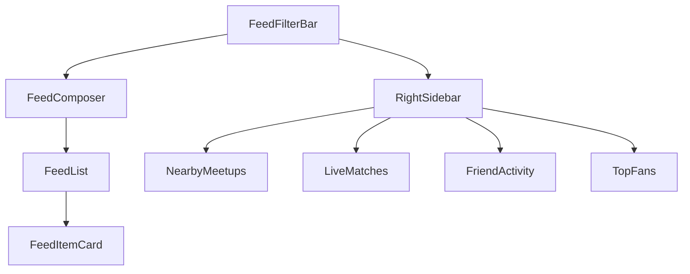

/docs/ui/community.md

````markdown
# 💬 SPORTSIVE — COMMUNITY PAGE STRUCTURE & SPEC
Version 1.0 · Updated: 2025-11-12

---

## 1. 🎯 Purpose
**Community Page**는 Sportsive의 중심 피드다.  
팬들이 **팀, 지역, 경기, 밋업, 라이브**와 관련된 모든 활동을 공유한다.  

> "경기 후기, 밋업 모집, 실시간 반응, 팬 추천"  
> — 이 모든 콘텐츠가 한곳에서 흐르는 팬 허브.

---

## 2. 🧭 Page Overview

| Section | 주요 역할 | 설명 |
|----------|------------|------|
| **FeedFilterBar** | 피드 타입 필터링 | `?type=post|meetup|live|relationship` |
| **FeedComposer** | 게시물 생성 / 액션 | 모드별 CTA 및 placeholder 변경 |
| **FeedList** | 피드 렌더링 | 서버에서 가져온 피드 목록 |
| **RightSidebar** | 추천 콘텐츠 / 활동 | 근처 밋업, 실시간 경기, 친구 활동, 팬 랭킹 |
| **ToastArea** | 토스트 메시지 | 성공/실패 알림, 포인트 적립 알림 등 |

---

## 3. 🧩 Component Structure

```text
CommunityPage
 ├── FeedFilterBar
 ├── FeedComposer
 ├── FeedList
 │     └── FeedItemCard
 │           ├── type: post
 │           ├── type: meetup
 │           ├── type: live
 │           └── type: relationship
 ├── RightSidebar
 │     ├── NearbyMeetups
 │     ├── LiveMatches
 │     ├── FriendActivity
 │     └── TopFans
 └── ToastArea
````

---

## 4. ⚙️ Data Flow

| 데이터       | 출처                       | 사용 위치                  | 설명                                  |
| --------- | ------------------------ | ---------------------- | ----------------------------------- |
| `feed`    | `/api/community/feed`    | FeedList               | 전체 피드 (type, team, user, region 필터) |
| `friends` | `/api/community/friends` | RightSidebar           | 친구의 최근 활동                           |
| `fans`    | `/api/community/fans`    | TopFans                | 팬 포인트 랭킹                            |
| `live`    | `/api/community/live`    | Sidebar / FeedItemCard | 실시간 경기 정보                           |
| `meetups` | `/api/community/meetups` | Sidebar                | 근처 밋업 표시                            |
| `post`    | `/api/community` (POST)  | FeedComposer           | 게시글 생성 API                          |

---

## 5. 🗺️ URL Query Parameters

| 파라미터     | 타입     | 설명       | 예시                                       |
| -------- | ------ | -------- | ---------------------------------------- |
| `type`   | string | 피드 모드    | `post`, `meetup`, `live`, `relationship` |
| `team`   | string | 특정 팀 필터  | `?team=arsenal`                          |
| `region` | string | 지역 필터    | `?region=london`                         |
| `user`   | string | 특정 유저 필터 | `?user=uid123`                           |

> **예시:**
> `/community?type=meetup&region=london&team=arsenal`

---

## 6. 💡 UX Mode Flow

### 📝 Mode: `post`

* Placeholder: “What’s on your mind? #matchday”
* CTA: `Post`
* Content: 경기 후기, 밈, 일반 대화
* +5 Fan Points

### 👥 Mode: `meetup`

* Placeholder: “Plan a watch party: Where & When?”
* CTA: `Create Meetup`
* Content: 모임 생성 / 참여 공유
* 커뮤니티 + 밋업 페이지 연동

### 🔴 Mode: `live`

* Placeholder: “Set up a live chat for the next match…”
* CTA: `Create Live Room`
* Content: 경기 중 실시간 대화방 개설
* 자동 연결 → `/live/:id`

### 🤝 Mode: `relationship`

* Placeholder: “Recommend a fan or teammate to follow…”
* CTA: `Share Recommendation`
* Content: 팬 추천 / 팔로우 알림

---

## 7. 🖥️ Layout Diagram (Mermaid)



---

## 8. 🎨 Visual System

| 요소           | 스타일                                                         | 설명                                        |
| ------------ | ----------------------------------------------------------- | ----------------------------------------- |
| 전체 컨테이너      | `max-w-7xl mx-auto grid gap-6 p-4 pt-24`                    | 2단 그리드 (피드 + 사이드바)                        |
| Composer     | `border rounded-xl p-4 bg-white dark:bg-gray-900 shadow-sm` | 글쓰기 입력창                                   |
| FeedItemCard | 타입별 테마 색상                                                   | `post: gray`, `meetup: blue`, `live: red` |
| Sidebar Card | `rounded-xl border bg-white dark:bg-gray-900 p-4 shadow-sm` | 정보 블록화                                    |
| Toast        | `sonner` 사용                                                 | 포인트, 게시 성공, 오류 알림 등                       |

---

## 9. ⚡ Data Fetching Logic

```ts
// FeedList.tsx (요약)
useEffect(() => {
  fetch(`/api/community/feed?${qs}`)
    .then(r => r.json())
    .then(data => setFeed(data.feed ?? []))
    .finally(() => setLoading(false))
}, [qs])
```

* 이벤트 기반 갱신:

  ```js
  window.dispatchEvent(new Event("refreshFeed"))
  ```
* Post 성공 시 토스트 알림:

  ```js
  toast.success("+5 Fan Points! 🎉")
  ```

---

## 10. 🔄 Integration with Other Pages

| 연결                        | 설명                          |
| ------------------------- | --------------------------- |
| `MeetupsPage` → Community | 밋업 생성 시 자동 포스트 등록           |
| `LivePage` → Community    | 경기 종료 시 자동 후기 업로드           |
| `TeamPage` → Community    | 팀별 피드 필터 (`?team=arsenal`)  |
| `ProfilePage` → Community | 사용자 글 모아보기 (`?user=uid123`) |

---

## 11. 🚀 Next Steps

* [ ] `region` 기반 필터 추가 (`?region=London`)
* [ ] `FeedComposer`에 팀 선택 / 지역 선택 기능 추가
* [ ] `FeedList` → 무한 스크롤 / pagination 적용
* [ ] `RightSidebar` → 사용자 위치 기반 데이터 필터
* [ ] 팬 포인트 시스템 → 누적 점수 프로필 반영
* [ ] AI Summary 기능: 인기 글 자동 요약 표시

---

## 12. 🧭 Vision

> “Community는 Sportsive의 실시간 심장이다.”
> 팬들이 단순히 소통하는 공간이 아니라,
> **팀 중심 + 지역 중심의 실시간 스포츠 문화 흐름**을 만든다.

**핵심 목표**

* ⚡ 빠른 피드백 (글 작성 → 바로 반영)
* 📍 지역 중심 콘텐츠 노출
* ⚽ 팀 기반 연결 유지
* 🏆 팬 포인트로 활동 동기 부여

```

---

📁 **저장 경로**
```

/docs/ui/community.md

```

✅ **VSCode 팁**
- “Markdown Preview Enhanced” 켜면 Mermaid 다이어그램, 표, 코드블록 다 렌더링됨.
- `/docs/ui/team-page.md` 와 구조 동일하니까  
  → 두 문서로 “Team + Community” 축 완전 정리됨.
