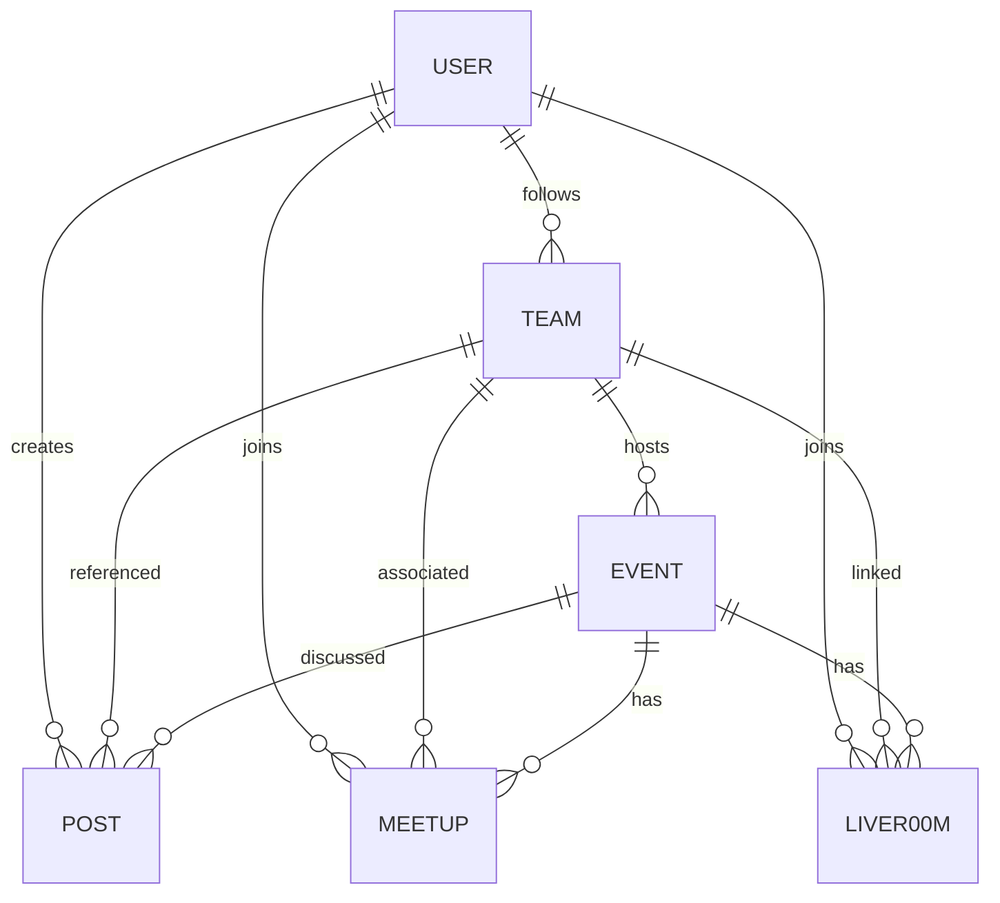

/docs/data/structure.md
---

````markdown
# 🧱 SPORTSIVE — DATA STRUCTURE & SCHEMA SPEC
Version 1.0 · Updated: 2025-11-12

---

## 1. 🎯 Purpose
이 문서는 **Sportsive의 핵심 데이터 모델 구조**를 정의한다.  
모든 페이지(`events`, `meetups`, `live`, `teams`, `community`, `profile`)는  
이 엔티티 관계를 기반으로 작동한다.

---

## 2. 📦 Core Entities

| Entity | 설명 |
|---------|------|
| `User` | 사용자 정보 / 팬 포인트 / 팔로우 |
| `Event` | 경기 정보 (지역 / 팀 / 일정) |
| `Meetup` | 팬 밋업 (오프라인 모임) |
| `LiveRoom` | 경기 실시간 채팅방 |
| `Team` | 팀 기본 정보 / 팬 통계 |
| `Post` | 커뮤니티 게시물 (post / meetup / live / relationship) |

---

## 3. 🧍 User Schema

```json
{
  "id": "uid_123",
  "name": "Jamie",
  "nickname": "Gooner_J",
  "email": "jamie@example.com",
  "photoUrl": "/avatars/uid_123.png",
  "region": "London",
  "joinedAt": "2025-03-12T12:30:00Z",
  "fanPoints": 230,
  "followingTeams": ["arsenal", "chelsea"],
  "followers": ["uid_456", "uid_789"],
  "following": ["uid_987"],
  "meetupsJoined": ["m_01", "m_02"],
  "liveRoomsJoined": ["l_07"],
  "badges": ["Early Fan", "Meetup Creator"]
}
````

📘 **Notes**

* 팬 포인트는 게시물, 밋업, 후기 작성 시 적립
* `followingTeams`는 `/teams/:id` 연결
* `region` 기반으로 추천 알고리즘 적용 가능

---

## 4. ⚽ Event Schema

```json
{
  "id": "evt_001",
  "title": "Arsenal vs Chelsea",
  "category": "football",
  "competition": "Premier League",
  "homeTeam": "Arsenal FC",
  "awayTeam": "Chelsea FC",
  "homeTeamLogo": "/logos/arsenal.png",
  "awayTeamLogo": "/logos/chelsea.png",
  "date": "2025-11-18T20:00:00Z",
  "venue": "Emirates Stadium",
  "city": "London",
  "region": "London",
  "location": { "lat": 51.5549, "lng": -0.1084 },
  "status": "Scheduled",
  "homepageUrl": "https://premierleague.com/match/12345"
}
```

📘 **Notes**

* `/api/events` 및 `/api/events/:region/:category`에서 사용
* 밋업 및 라이브룸과 연결됨

---

## 5. 🤝 Meetup Schema

```json
{
  "id": "m_01",
  "title": "Watch Arsenal Match Together!",
  "eventId": "evt_001",
  "teamId": "arsenal",
  "hostId": "uid_123",
  "datetime": "2025-11-18T19:00:00Z",
  "location": {
    "name": "Camden Pub",
    "lat": 51.541,
    "lng": -0.143
  },
  "participants": ["uid_123", "uid_456"],
  "pendingParticipants": ["uid_789"],
  "maxParticipants": 10,
  "type": "public",
  "ageLimit": "18+",
  "createdAt": "2025-11-10T10:00:00Z"
}
```

📘 **Notes**

* `eventId`로 경기와 연결
* `teamId`로 팀 페이지 연동
* 자동 만료 정책: 12시간 지난 밋업은 삭제 처리

---

## 6. 🔴 LiveRoom Schema

```json
{
  "id": "l_07",
  "eventId": "evt_001",
  "title": "Arsenal vs Chelsea Live Chat",
  "participants": ["uid_123", "uid_456", "uid_789"],
  "datetime": "2025-11-18T20:00:00Z",
  "status": "LIVE",
  "homeTeam": "Arsenal FC",
  "awayTeam": "Chelsea FC",
  "homeTeamLogo": "/logos/arsenal.png",
  "awayTeamLogo": "/logos/chelsea.png"
}
```

📘 **Notes**

* 경기 시작 2시간 전부터 입장 가능
* 종료 후 `Community`에 후기 자동 업로드

---

## 7. 🏟 Team Schema

```json
{
  "id": "arsenal",
  "name": "Arsenal FC",
  "logo": "/logos/arsenal.png",
  "region": "London",
  "stadium": "Emirates Stadium",
  "founded": 1886,
  "fans": 2841,
  "description": "One of the most historic football clubs in England.",
  "topFans": [
    { "userId": "uid_123", "points": 230 },
    { "userId": "uid_456", "points": 220 }
  ]
}
```

📘 **Notes**

* 지역 기반 팀 페이지(`/teams/:id?region=london`)에서 사용
* `fans`는 지역별 팬 수 합계

---

## 8. 💬 Post (Community Feed) Schema

```json
{
  "id": "p_01",
  "userId": "uid_123",
  "userName": "Jamie",
  "teamId": "arsenal",
  "type": "post",
  "region": "London",
  "content": "Amazing match today! What a goal by Saka ⚽",
  "createdAt": "2025-11-12T10:00:00Z",
  "meta": {
    "likes": 34,
    "comments": 5,
    "status": "published"
  }
}
```

📘 **Notes**

* `type`에 따라 UI가 다르게 렌더링됨
* `relationship` 타입은 팬 추천 / 팔로우 안내
* `region` 필터로 지역 중심 피드 가능

---

## 9. 🔗 Entity Relationships (Mermaid)



---

## 10. 🧩 Derived Data / Aggregations

| 데이터              | 설명           | 계산 예시                                    |
| ---------------- | ------------ | ---------------------------------------- |
| `fanPointsTotal` | 전체 팬 포인트 합계  | `sum(posts * 5 + meetups * 10)`          |
| `activeMeetups`  | 현재 진행 중 밋업 수 | `meetups.filter(now < datetime < +12h)`  |
| `liveNow`        | 현재 LIVE 경기 수 | `liveRooms.filter(status === "LIVE")`    |
| `topRegions`     | 팬 활동 많은 지역   | `groupBy(region).orderBy(activityCount)` |

---

## 11. 🧭 Storage Rules (Firebase 예시)

```json
{
  "rules": {
    "meetups": {
      ".read": "auth != null",
      ".write": "auth != null && auth.uid == newData.child('hostId').val()"
    },
    "posts": {
      ".read": "true",
      ".write": "auth != null"
    }
  }
}
```

---

## 12. 🚀 Next Steps

* [ ] `region` 필드 통일 (`city` → `region`)
* [ ] `Post.meta` 확장 (views, shares 추가)
* [ ] `Meetup` → `approvedParticipants` 필드 분리
* [ ] `LiveRoom` → 메시지 저장 구조 추가 (`messages[]`)
* [ ] `Team` → 지역별 팬 통계 테이블 추가

---

## 13. 🌍 Vision

> “데이터 구조는 Sportsive의 근간이다.”
> 모든 페이지가 유기적으로 연결되어야
> 팬 경험이 하나의 생태계로 느껴진다.

**핵심 원칙**

* 단일 데이터 → 다중 기능 (한 소스, 여러 연결)
* 이벤트 중심 구조 (event → meetup → live → community)
* 지역 기반 확장성 확보

```

---

📁 **저장 경로**
```

/docs/data/structure.md

```

✅ **활용 팁**
- 이 문서로 Firebase Collection / Supabase Table 설계 가능  
- 나중에 `/api` 레이어 정의할 때 → 이 구조 그대로 TypeScript 타입으로 변환 가능 (`types.ts`)  
- Mermaid 다이어그램도 바로 시각화됨  
