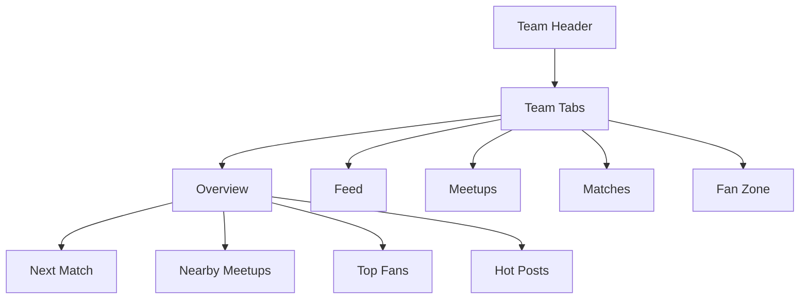
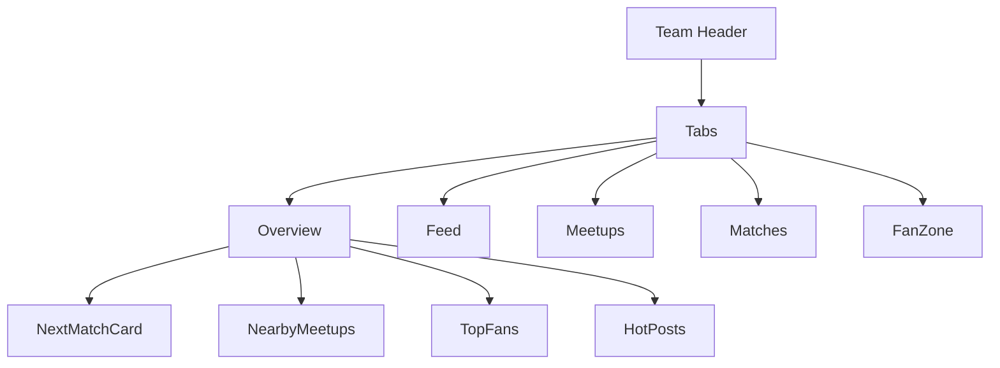

/docs/ui/teamPage.md

````markdown
# 🏟 SPORTSIVE — TEAM PAGE REDESIGN SPEC
Version 1.0 · Updated: 2025-11-12

---

## 1. 🎯 Purpose
**Team Page**는 Sportsive의 지역 기반 팬 허브다.  
팀 중심으로 팬, 경기, 밋업, 라이브, 커뮤니티 피드를 한 화면에 통합한다.  

> “팀 + 지역” 중심의 실시간 스포츠 네트워크  
> → 팬들이 같은 팀을 응원하면서도 **내 주변 활동**을 함께 볼 수 있는 공간

---

## 2. 🧭 Page Overview

| Section | 역할 | 설명 |
|----------|------|------|
| **Header (Hero)** | 팀 핵심 정보 | 로고, 팬 수, CTA(`Join Fans`) |
| **Tabs** | 콘텐츠 전환 | `Overview / Feed / Meetups / Matches / Fan Zone` |
| **Overview** | 지역 + 팀 요약 | 팬 현황, 근처 밋업, 다음 경기, 인기 게시물 |
| **Feed** | 팀 커뮤니티 피드 | `/api/community/feed?team=` 연동 |
| **Meetups** | 팀 관련 밋업 | `/api/meetups?team=` 연동 |
| **Matches** | 팀 경기 일정 | `/api/events?teamId=` 연동 |
| **Fan Zone** | 팬 활동 / 투표 | 팬 순위, 챌린지, 참여 이벤트 등 |

---

## 3. 🧩 Component Structure

```text
TeamPage
 ├── TeamHeader
 ├── TeamTabs
 ├── TabContent (switch)
 │     ├── TeamOverview
 │     │     ├── NextMatchCard
 │     │     ├── NearbyMeetups
 │     │     ├── TopFans
 │     │     └── HotPosts
 │     ├── TeamFeed
 │     │     └── FeedItemCard[]
 │     ├── TeamMeetups
 │     │     └── MeetupCard[]
 │     ├── TeamMatches
 │     │     └── MatchCard[]
 │     └── FanZone
 │           ├── FanPoll
 │           ├── ChallengeBoard
 │           └── LocalRanking
 └── RightSidebar (optional)
       ├── UpcomingEvents
       ├── LiveNow
       └── LocalFans
````

---

## 4. 🗺️ Page Flow Diagram (Mermaid)



---

## 5. ⚙️ Data Sources

| 데이터     | API                         | 사용 컴포넌트                         | 설명              |
| ------- | --------------------------- | ------------------------------- | --------------- |
| 팀 기본 정보 | `/api/teams/:teamId`        | `TeamHeader`                    | 로고, 팬 수, 지역, 설명 |
| 팀 경기 일정 | `/api/events?teamId=`       | `TeamMatches` / `NextMatchCard` | 다음 경기 / 전체 일정   |
| 팀 밋업    | `/api/meetups?team=`        | `TeamMeetups` / `NearbyMeetups` | 팬 밋업 목록         |
| 팀 피드    | `/api/community/feed?team=` | `TeamFeed` / `HotPosts`         | 팀 관련 게시물        |
| 팬 순위    | `/api/community/fans?team=` | `TopFans`, `FanZone`            | 팀 내 상위 팬        |
| 실시간 경기  | `/api/community/live?team=` | Sidebar                         | 현재 진행 중 경기      |

---

## 6. 🧠 UX Flow (User Scenarios)

### ⚽ [팀 팬이 지역 기반 활동을 탐색]

1. `/teams/arsenal?region=london` 진입
2. 상단 헤더 → “Join Fans” 클릭 (팬 등록)
3. `Overview` 탭 → “Nearby Meetups” 확인
4. 참여 or 직접 생성
5. 이후 커뮤니티 피드에 자동 공유

---

### 🤝 [팀 밋업 생성 → 팬 연결]

1. `Meetups` 탭 → “Create Meetup”
2. 지역, 장소, 시간 입력
3. 생성 후 `/api/community`에 자동 포스트 등록
4. 다른 팬이 참가 시 실시간 업데이트

---

### 🔴 [라이브 중 실시간 참여]

1. 경기 시작 시 “Join Live Room” 버튼 활성화
2. `/live?eventId=` 이동
3. 응원 후 → 후기 자동 포스팅 `/community`

---

## 7. 🎨 Layout System

| 구역      | Tailwind Grid                                                   | 설명                   |
| ------- | --------------------------------------------------------------- | -------------------- |
| 전체      | `max-w-7xl mx-auto grid lg:grid-cols-[2fr_1fr] gap-6 p-4 pt-24` | 메인 + 사이드             |
| Header  | `flex flex-col md:flex-row items-center justify-between`        | 로고 + CTA + 팬 정보      |
| Tabs    | `flex gap-3 border-b mb-4`                                      | 라우터 기반 탭             |
| Content | `rounded-xl bg-white dark:bg-gray-900 p-4`                      | 각 탭별 내용              |
| Sidebar | `space-y-4`                                                     | Live Now, Top Fans 등 |

---

## 8. 💬 Header / CTA Spec

| 요소  | 내용                             |
| --- | ------------------------------ |
| 로고  | 팀 엠블럼 (`logo` 필드)              |
| 이름  | 팀명 (`name`)                    |
| 팬 수 | `/api/teams/:id/fans/count`    |
| 지역  | `region` 표시 (예: “London”)      |
| CTA | `Join Fans / Leave Fanbase` 버튼 |
| 보조  | 다음 경기 일정 (`NextMatchCard`)     |

---

## 9. 🪧 Tabs & Routing

| 탭        | 경로                   | 컴포넌트           | 설명      |
| -------- | -------------------- | -------------- | ------- |
| Overview | `/teams/:id`         | `TeamOverview` | 팀 현황 요약 |
| Feed     | `/teams/:id/feed`    | `TeamFeed`     | 팀 관련 피드 |
| Meetups  | `/teams/:id/meetups` | `TeamMeetups`  | 팀 밋업 목록 |
| Matches  | `/teams/:id/matches` | `TeamMatches`  | 경기 일정   |
| Fan Zone | `/teams/:id/fanzone` | `FanZone`      | 팬 참여 활동 |

---

## 10. 🔗 API 연결 구조

```text
/api/teams/:teamId
 ├── events?teamId= → 경기 일정
 ├── meetups?team= → 밋업
 ├── community/feed?team= → 게시글
 ├── community/fans?team= → 팬 순위
 └── live?team= → 실시간 경기
```

---

## 11. 🧩 주요 컴포넌트 상세

### 🧱 TeamHeader

* 팀 이름, 로고, 지역, 팬 수
* CTA: Join/Leave Fans
* 다음 경기 표시 (NextMatchCard)

### 🧭 TeamTabs

* React Router 기반 탭
* URL 기반 전환 (예: `/teams/arsenal/feed`)

### 🏟 TeamOverview

* “한눈에 보는 팀 현황”

  * Next Match
  * Nearby Meetups (3개)
  * Hot Posts (인기 피드)
  * Top Fans

### 💬 TeamFeed

* `/api/community/feed?team=` 기반
* `FeedItemCard` 재사용
* 팀 전용 피드 필터
* +5 Fan Points on post

### 👥 TeamMeetups

* `/api/meetups?team=`
* `MeetupCard` 재사용
* Join / Leave / Approve 기능 유지

### ⚽ TeamMatches

* `/api/events?teamId=`
* 경기 일정 표시
* Live 상태면 `Join Live Room` 버튼 노출

### 🏆 FanZone

* 팬 투표, 팬 챌린지, TopFans 표시
* `/api/community/fans?team=` 데이터 기반

---

## 12. 📊 Example Layout (Mermaid)



---

## 13. 🔄 Integration Points

| 연결        | 설명                             |
| --------- | ------------------------------ |
| Community | `/api/community/feed?team=` 공유 |
| Meetups   | 팀 기반 밋업 자동 등록                  |
| Live      | 경기 상태 LIVE 시 자동 강조             |
| Profile   | “My Teams” → 팀 페이지 링크          |
| Events    | `/api/events?teamId=` 으로 연동    |

---

## 14. 🚧 Next Steps

* [ ] `/teams/[teamId]/page.tsx` 리팩토링 시작
* [ ] `TeamHeader`, `TeamTabs`, `TeamOverview` 컴포넌트 생성
* [ ] 지역 기반 API (`?region=`) 반영
* [ ] Sidebar → Nearby Fans / Live Now 추가
* [ ] “Join Fans” 기능 Firebase Auth 연결
* [ ] `/api/teams/:id/fans/count` 캐시 적용

---

## 15. 💬 Vision

> “Team Page는 팬 경험의 중심이다.”
>
> 단순한 팀 소개를 넘어,
> 지역 커뮤니티와 연결되고,
> 팬들이 함께 움직이는 플랫폼으로 진화한다.

**핵심 목표**

* ⚽ 팀 중심 + 📍 지역 중심
* 🔄 피드, 밋업, 라이브, 경기 완전 통합
* 🧍 팬 경험 일원화

